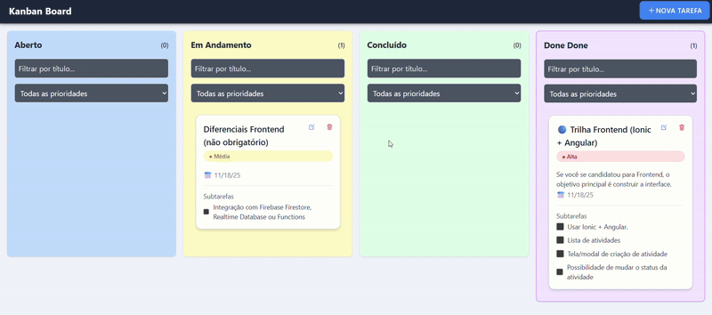
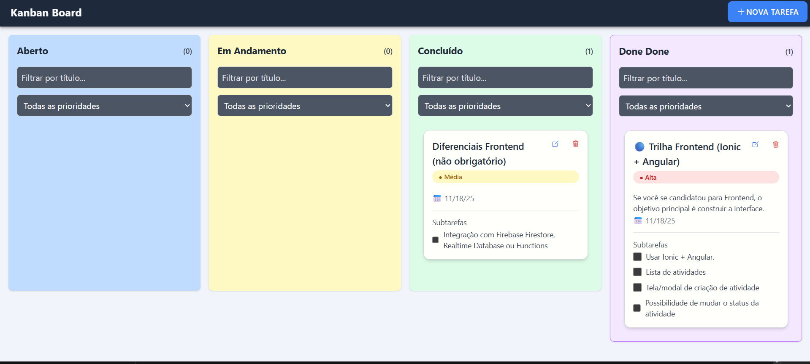
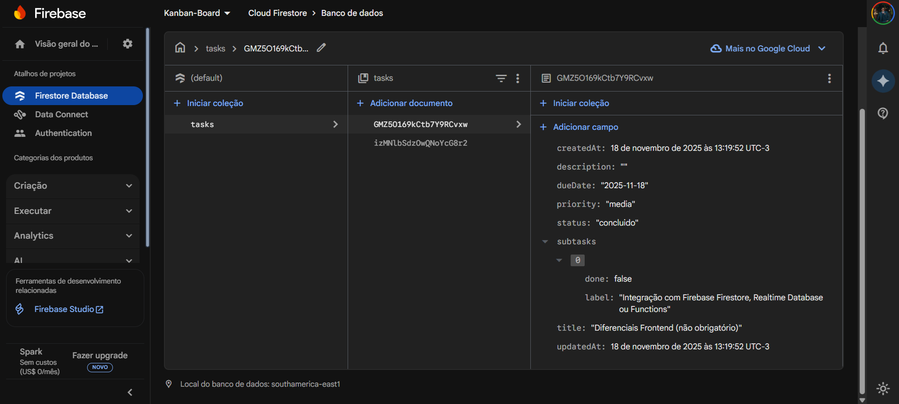

-----

# 📋 Kanban List – Ionic + Angular + Firebase

Um **Kanban Board moderno, responsivo e em tempo real**, desenvolvido como desafio técnico para a vaga de estágio (Frontend) da Cyrrus Next Systems.

O projeto utiliza a stack moderna **Ionic 7 + Angular 17 (Standalone)** e destaca-se pela integração completa com **Firebase Firestore** para persistência de dados na nuvem.


---

## 🚀 Tecnologias Utilizadas

  * **Framework:** Ionic 7 (Standalone Components) + Angular 17 
  * **Estilização:** TailwindCSS (Design System customizável)
  * **Backend / Banco de Dados:** Firebase Firestore (NoSQL em tempo real) 
  * **Linguagem:** TypeScript
  * **Deploy:** GitHub Pages

-----

## 📦 Funcionalidades

### 📝 Gestão de Tarefas Avançada

  * **CRUD Completo:** Criar, Ler, Atualizar e Deletar tarefas.
  * **Campos detalhados:** Título, Descrição, Status, Prioridade (Baixa, Média, Alta), Data de Entrega e Subtarefas (Checklist).

### 🎯 Workflow Kanban 

  * **4 Colunas Fixas:** Aberto, Em Andamento, Concluído, Done Done.
  * **Cores Semânticas:** Identificação visual rápida para cada estado e prioridade.
  * **Contadores:** Visualização do total de tarefas por coluna.

### ✨ Interatividade e UX

  * **Drag & Drop:** Arraste e solte tarefas entre colunas para atualizar o status automaticamente.
  * **Filtros Dinâmicos:** Filtragem em tempo real por Título e Prioridade dentro de cada colun.
  * **Persistência Offline:** Suporte a funcionamento offline (cache do Firestore).

-----

## ⚙️ Como rodar o projeto localmente 

### 1️⃣ Pré-requisitos

Certifique-se de ter o **Node.js** e o **Ionic CLI** instalados.

### 2️⃣ Instalação

Clone o repositório e instale as dependências:

```bash
git clone https://github.com/adrianoads910-max/Kanban-List-Ionic-Angular.git
cd Kanban-List-Ionic-Angular
npm install
```

### 3️⃣ Execução

Inicie o servidor de desenvolvimento:

```bash
ionic serve
```

O projeto abrirá automaticamente em `http://localhost:8100`.

-----

## 📱 Preview (Screenshots)

### 🎥 Funcionamento (Demo)


---

### 📸 Capturas de Tela

| Kanban Board (Frontend) | Integração Firebase (Backend) |
| :---: | :---: |
|  |  |

## 🧠 Decisões de Projeto (Q\&A Obrigatório)

]Conforme solicitado no desafio técnico, abaixo estão as respostas sobre o desenvolvimento.

### 1. Qual foi sua lógica para estruturar o projeto? [

Optei pela arquitetura moderna de **Standalone Components** do Angular 17 para reduzir a complexidade e tornar a aplicação mais leve.
A estrutura foi dividida em:

  * **Pages:** A `KanbanPage` atua como o orquestrador inteligente, conectando-se ao serviço de dados.
  * **Components:** Componentes "burros" (dumb components) como `KanbanColumn` e `TaskCard` apenas recebem dados (`@Input`) e emitem eventos (`@Output`), garantindo reutilização e facilidade de teste.
  * **Services:** O `TaskService` centraliza toda a lógica de negócios e comunicação com o Firebase, utilizando `Observables` para garantir que a interface seja reativa e atualizada em tempo real.

### 2. Que parte você achou mais difícil ou travou? 

O maior desafio foi a configuração do **deploy em produção** combinando Ionic, TailwindCSS e GitHub Pages.
Houve um problema específico onde o mecanismo de "Purge" do Tailwind removia as classes CSS dinâmicas das colunas (cores de fundo) no build final. Foi necessário configurar o `safelist` no `tailwind.config.js` e ajustar as variáveis de ambiente (`environment.prod.ts`) para garantir que o Firebase e os estilos carregassem corretamente fora do `localhost`.

### 3. O que faria diferente se tivesse mais tempo? 

  * **Testes Unitários:** Implementaria testes com Jasmine/Karma para garantir a estabilidade do `TaskService` e dos componentes visuais.
  * **Drag & Drop Mobile:** Melhoraria a experiência de toque (touch) no mobile usando a biblioteca `Angular CDK DragDrop` com configurações específicas para evitar conflito com o scroll da tela.
  * **Autenticação:** Implementaria o Firebase Auth para que cada usuário tivesse seu próprio quadro privado.

### 4. O que faria diferente se fosse para um cliente real? 

  * **Segurança:** Configuraria as *Security Rules* do Firestore para permitir leitura/escrita apenas para usuários autenticados, protegendo o banco de dados.
  * **Feedback de Erro:** Implementaria um interceptador HTTP global e serviços de Toast/Alert para avisar o usuário amigavelmente caso a conexão caísse ou ocorresse um erro no servidor.
  * **Acessibilidade (a11y):** Focaria mais em atributos ARIA e navegação por teclado para garantir que o Kanban fosse utilizável por leitores de tela.

### 5\. Você usou alguma ferramenta ou IA para ajudar? Como? 

Sim, utilizei IA (Gemini) como um "Pair Programmer".
A IA foi fundamental para:

1.  Acelerar a configuração inicial do Firebase (v9 modular).
2.  Refatorar o código para o padrão Standalone do Angular, garantindo as melhores práticas atuais.
    A lógica de negócios e a estruturação dos componentes foram guiadas pelos requisitos do desafio, usando a IA para otimizar a sintaxe e resolver bugs específicos de configuração.

-----

## 👨‍💻 Autor

**Adriano ADS**
🔗 GitHub: [https://github.com/adrianoads910-max](https://github.com/adrianoads910-max)
